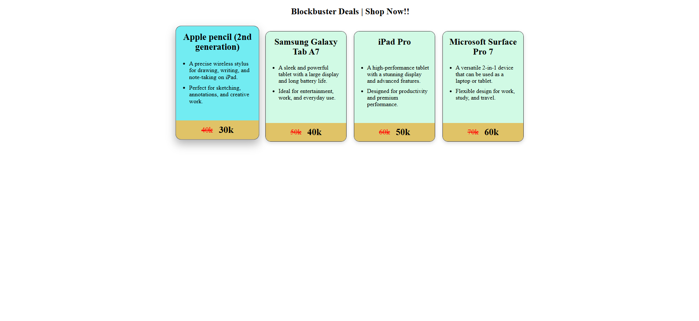

# React Learning

This repository contains my React learning projects and UI practice components.

## Amazon Product Cards UI

A React component-based product cards interface demonstrating:

- Props
- Components
- Dynamic Rendering
- CSS Flexbox
- Hover Effects
- Card Styling
- Reusable Components

## Preview



## Technologies Used

- React
- Vite
- JavaScript
- CSS

## Run Locally

```bash
npm install
npm run dev
```

## Author

Vishal Lokhande